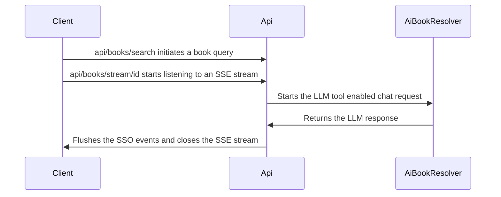

# Find That Book

A small technical challenge that addresses a [take-home project](docs/product_requirements.md).

## Setup

#### Prerequisites

1. dotnet 10 runtime/sdk
1. node 24+
1. [A gemini api key](https://ai.google.dev/gemini-api/docs/api-key)
1. [optional] node version manager (nvm or fnm which should automatically recognize the node version when cd into the client dir)
1. [optional] make to run the makefile helper
   1. note that this was tested on linux, the publish/deploy make targets are definitely incompatible with windows, but others should work (again, untested outside of linux)
1. [optional] install [semgrep](https://github.com/semgrep/semgrep) to run `make scan` which performs a security static code analysis of the repo

#### Configuration

Specify `GEMINIAPIKEY` key value in .env, appsettings.json, or launchSettings.json depending on your development environment. Really, I should have just stuck with a docker/container dev and prod environment to simplify this setup in various environments, but will keep this disparate config setup for now.

#### Running the app

1. clone this repo `git clone ssh@github.com/jamessantiago/feedthatbook
1. run the project `cd feedthatbook && make run` or if make is unavailable `cd feedthatbook/client && npm run start`

## Architecture Overview

### 1. Backend Tech stack and library choice

- .net 10 minimal web api
  - a lot of this is interchangeable with a full mvc deployment
  - specifically non-aot to avoid anything that can't be "trimmed" and require a library replacement or backtrack on implementation
- openapi for grabbing an endpoint/dto schema, will likely hand crank the frontend though since the schema should be minimal, but if the api grows large enough we can import the openapi schema into the frontend to keep our api and consumer in sync
- GeminiDotnet - this is our Microsoft AI compliant implementation of a LLM chat client
  - note that this is a small project with limited usage (stars), contributors, and at a 0.\* version. This puts the library at risk of maintenance and security issues, but is fine for a project of this scale.
- Microsoft.Extensions.AI - we'll set this up as a service layer between our domain and the LLM provider to allow for us to swap out gemini for something else such as anthropic, openai, etc...

### 2. Client Tech stack and library choice

- react with mantine

Using react here specifically to show some familiarity with the framework over other such as angular or vue give that the stakeholders specifically have callouts to this framework.

Mantine UI is selected as a simple helper UI library to avoid too much boilerplate UI work. The [minimal vite template](https://github.com/mantinedev/vite-min-template) provided by mantine was used as a basis for the client.

### 3. LLM Usage Design

The LLM based interactions are typically either a single slow call (what we're using) or a stream of messages. In either case we have a slow interaction that poses a problem to the user experience if we simply wait on a slow call. Instead we'll setup a simple server-sent event (SSE) stream. On first request we'll kickoff a background thread to run the query using the `AiBookResolver` service and then on completion write the data to a standard c# `Channel` which in turn sends out an event to any listening (or about to listen) client.

An alternative here is to switch the `LlmService` that `AiBookResolver` leverages to a message stream, similar to what you'd see in various LLM chat services where the response (e.g. thinking and word-by-word streams) is streamed to the browser. Websockets can of course be used as well, but we simply need a listen only stream. A long-poll approach is an option, but there's additional overhead on managing the poll timing and a less immediate response to the user experience.

### 4. Testing

1. Unit tests are provided for both the client (vitest) and backend (nunit w/ NSubstitute) to provide method logic coverage
1. a near 100% code coverage was targeted here
1. Functional tests are provided with `Api.http`, a simple postman like set of calls using rider's http client feature
1. User experience testing is done manually here, the next step to improve this would be to move to playwrite
1. LLM test bench, this is also manual, the extension here would be a set of functional tests that evaluate the performance of LLM responses to allow for evaluation of prompt changes or LLM model updates/swaps

Note: run `make test` to run both backend and client test simultaneously

### 5. Additional Design Choices

#### Observability

Logging is very simple with serilog and a rotating file based log being the main point of observability for app level issues in production. The missing components here are user usage tracking (e.g. posthog, mixpanel), telemetry (specifically open telemetry against any compatible provider such as aspire, appinsights, honeycomb, etc... ). Lastly is the infrastructure itself. In this case, it's a simple linux VM running in my vsphere lab behind a pfsense firewall which I'm perfectly ok with letting explode.

#### Infrastructure/Core/Api Services

There's a simple split here that allows for both a separation of responsibilities and extending or swapping out services without too much coupling. Each provide their own service registration extension method.

#### CI/CD

There's no CI/CD here, so the manual approach to development is:

1. Make changes
1. Lint the codebase (use `make lint`, there's no editor config so it's all default)
1. Check tests (use `make test`)
1. Check for any security warnings (`make scan`)
1. Run locally and validate experience
1. Deploy (`make deploy-service`)

We'd want to move this over to github actions or similar to automate the change process and ensure no steps are skipped

#### More

1. Authentication - e.g. social logins with google
1. Authorization - potential permission system for additional features, consider an anti-forgery token setup or tighter client/backend interaction
1. Throttle - the queries should be throttled by IP or later auth token
1. Improved design - needs a bit of explanation on what the site does, ideally by implicit design, dark mode, links back to main site/github
1. Different deployment setups, a k8s config and split client/backend images
1. Infrastructure, terraform files for preparing the appropriate infra pieces (dns, proxy, server, config, etc...)

### 6. AI Notice

For this project I leveraged opencode and the `DeepSeek V4 Flash Free` model to help with some of the more monotonous pieces such as test coverage. For security, I used [firejail](https://github.com/netblue30/firejail) to limit opencode's access to sensitive data such as my dotfiles and this project's .env files. No agents.md (the open equivalent to .claude), skills, or agents were used as LLM driven feature development wasn't my intention for completing this project. However, an agents.md/claude file should likely be created in the future to help with future feature development work if leveraged.
